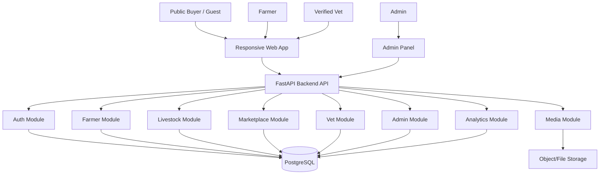
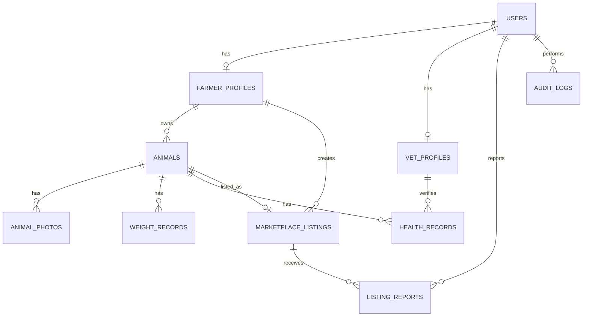
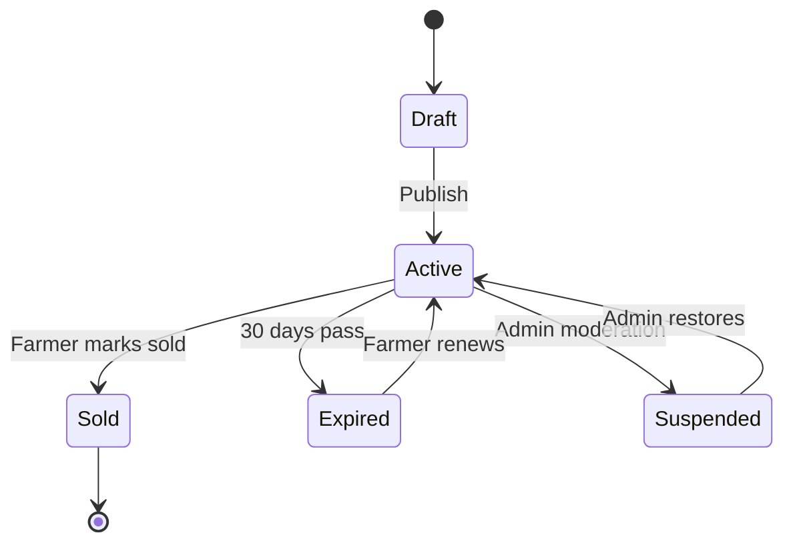
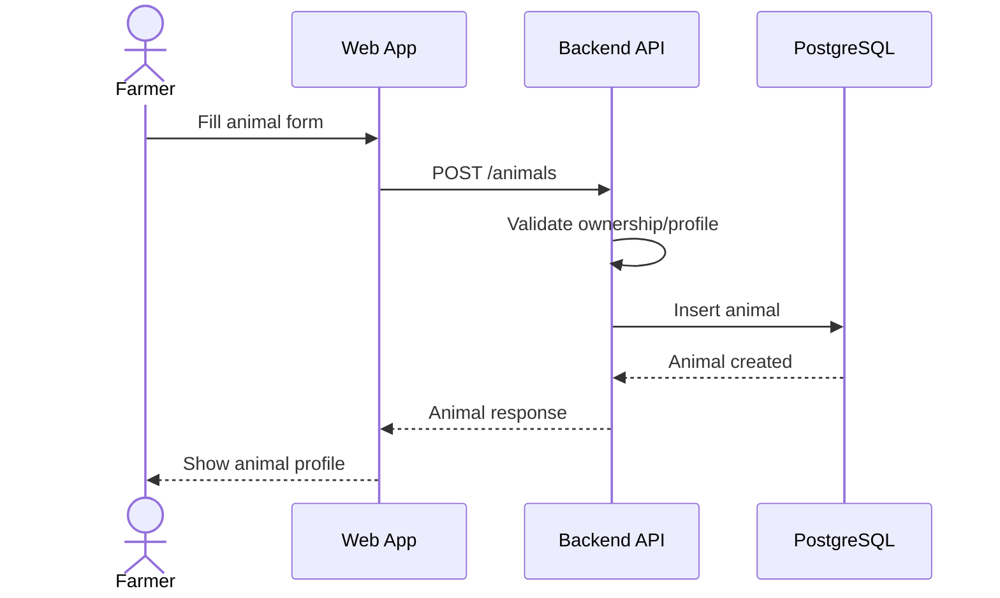
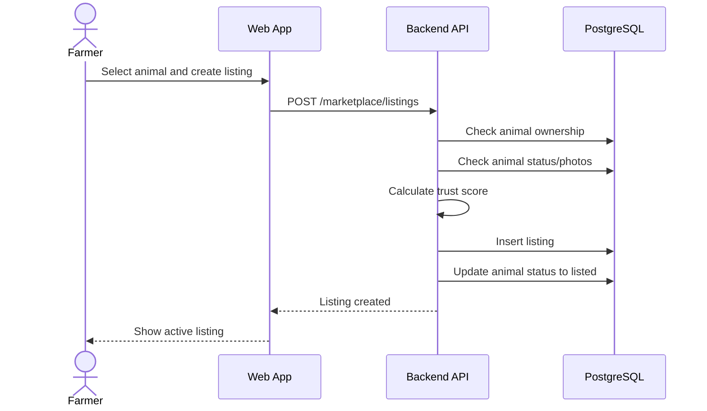
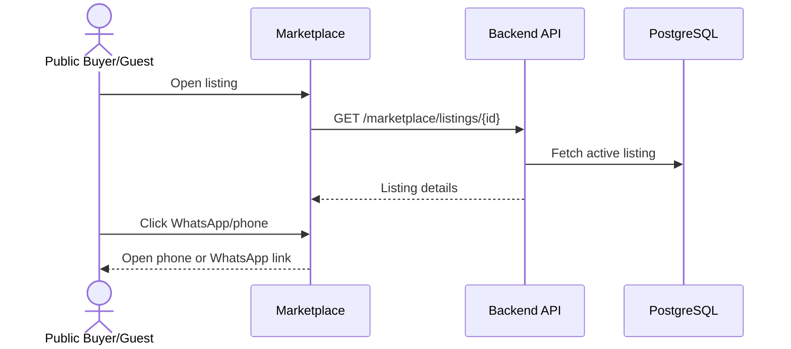
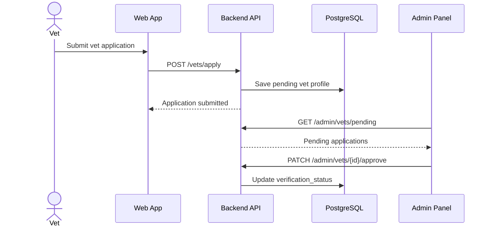
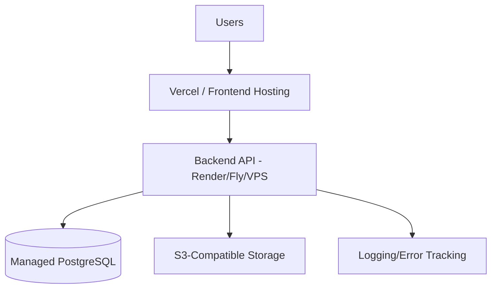

# V1 System Architecture — Morocco Livestock Management & Marketplace Platform

This is the V1 architecture for a **startup MVP**, not a thesis toy. The architecture should be implementation-ready, controlled in scope, and designed so the future government analytics layer can be added later without rebuilding the database from zero.

The frontend must stay aligned with real backend contracts, use modular screens, include loading/error/empty/success states, handle slow networks, and avoid invented API behavior. 

---

## 1. Executive Summary

The platform is a **responsive web app for Moroccan livestock farmers**. Farmers register animals, track growth and health, create sale listings, and connect with buyers through phone or WhatsApp. Public buyers/guests browse national listings with regional filtering. Verified vets appear in a directory. Admins verify vets, moderate listings, and manage suspicious activity.

V1 does **not** include payments, mobile native apps, government dashboards, QR tags, AI diagnosis, logistics, or insurance.

The correct V1 is:

> **A web-first livestock registry + growth tracker + national marketplace + verified vet directory + admin moderation system.**

---

## 2. V1 Product Goals

| Goal | Description |
|---|---|
| Farmer organization | Replace messy notebooks, spreadsheets, and paper animal records |
| Sales access | Let farmers list livestock nationally and receive direct buyer contact |
| Growth visibility | Help farmers track weight, health, age, and sale readiness |
| Trust foundation | Start reducing fake listings using phone verification, photos, reporting, and admin moderation |
| Vet trust | Allow only admin-verified vets to appear as verified professionals |
| Future analytics readiness | Store clean regional livestock data for later government/institutional dashboards |

---

## 3. V1 Out of Scope

These are banned from V1. If you add them now, you are bloating the MVP.

| Feature | Reason |
|---|---|
| Government dashboard | Future enterprise layer |
| Online payments | Legal, fraud, refund, and trust complexity |
| Escrow | Too heavy before marketplace liquidity exists |
| Native mobile app | Web-first is enough for validation |
| QR animal tagging | Later verification phase |
| AI animal diagnosis | Medical/legal risk and unreliable without data |
| Transport/logistics | Separate business problem |
| Livestock insurance | Regulatory and operational complexity |
| Auction system | Not needed before basic listings work |
| IoT weight sensors | Expensive distraction |
| Blockchain registry | Completely unnecessary for V1 |

---

## 4. Core Assumptions

| Item | Decision |
|---|---|
| Product type | Startup MVP |
| Target country | Morocco |
| First platform | Responsive web app |
| Mobile support | Mobile browser optimized, not native app |
| Marketplace | National marketplace with strong region/province filtering |
| Payments | Not included |
| Buyer contact | Phone and WhatsApp |
| Government dashboard | Not V1, but data prepared for future aggregation |
| Animal entry | Manual in V1 |
| Verification | Basic trust system, not certified national registry |
| Vet profiles | Admin-verified professionals only |
| Languages | Arabic + French, with Darija-friendly helper text |

---

# 5. User Roles and Permissions

## 5.1 Role Table

| Role | Description |
|---|---|
| Public buyer/guest | Unauthenticated visitor browsing public marketplace/vets; not a stored `UserRole` in V1 |
| Farmer | Main user managing livestock and listings |
| Vet | Professional account that can apply for verification and appear publicly only after admin approval |
| Admin | Internal operator managing moderation and verification |

Stored V1 user roles are only `farmer`, `vet`, and `admin`. Registered buyer accounts are out of scope for V1.

Admin users must be created only through `backend/app/scripts/create_admin.py`. Public registration must reject the `admin` role.

---

## 5.2 Permission Matrix

| Action | Public buyer/guest | Farmer | Vet | Admin |
|---|---:|---:|---:|---:|
| Browse marketplace | Yes | Yes | Yes | Yes |
| View listing details | Yes | Yes | Yes | Yes |
| Contact seller | Yes | Yes | Yes | Yes |
| Register farmer/vet account | Yes | No | No | No |
| Create animal record | No | Yes | No | Yes |
| Edit own animal | No | Yes | No | Yes |
| Delete own animal | No | Yes | No | Yes |
| Add weight record | No | Yes | No | Yes |
| Add health record | No | Yes | No | Yes |
| Create listing | No | Yes | No | Yes |
| Edit own listing | No | Yes | No | Yes |
| Report listing | Yes | Yes | Yes | Yes |
| Apply as vet | No | No | Yes | No |
| Appear as verified vet | No | No | Yes, after approval | Yes |
| Verify vet | No | No | No | Yes |
| Moderate listing | No | No | No | Yes |
| Suspend user | No | No | No | Yes |
| View platform stats | No | No | No | Yes |

---

# 6. Functional Requirements

## 6.1 Auth Requirements

| ID | Requirement | Priority |
|---|---|---|
| FR-AUTH-001 | Farmer or vet can register with phone number and password | Must |
| FR-AUTH-002 | User can log in | Must |
| FR-AUTH-003 | User can log out | Must |
| FR-AUTH-004 | User can fetch current profile | Must |
| FR-AUTH-005 | System supports roles: farmer, vet, admin | Must |
| FR-AUTH-006 | Phone verification endpoint is documented but deferred until SMS/OTP provider selection | Later |
| FR-AUTH-007 | Password reset by phone/email | Later |

---

## 6.2 Farmer Requirements

| ID | Requirement | Priority |
|---|---|---|
| FR-FARMER-001 | Farmer can create profile | Must |
| FR-FARMER-002 | Farmer can edit farm profile | Must |
| FR-FARMER-003 | Farmer must select region and province | Must |
| FR-FARMER-004 | Farmer can view dashboard summary | Must |
| FR-FARMER-005 | Farmer can see profile completion score | Should |

---

## 6.3 Animal Registry Requirements

| ID | Requirement | Priority |
|---|---|---|
| FR-ANIMAL-001 | Farmer can create animal record | Must |
| FR-ANIMAL-002 | Farmer can list own animals | Must |
| FR-ANIMAL-003 | Farmer can view animal detail | Must |
| FR-ANIMAL-004 | Farmer can edit animal data | Must |
| FR-ANIMAL-005 | Farmer can archive/delete animal | Must |
| FR-ANIMAL-006 | Farmer can upload animal photos | Must |
| FR-ANIMAL-007 | Animal has species, breed, sex, age/birth date | Must |
| FR-ANIMAL-008 | Animal has health status | Must |
| FR-ANIMAL-009 | Animal has ownership/sale status | Must |
| FR-ANIMAL-010 | Animal has verification level | Must |
| FR-ANIMAL-011 | Animal has event history | Should |

---

## 6.4 Growth Tracking Requirements

| ID | Requirement | Priority |
|---|---|---|
| FR-GROWTH-001 | Farmer can add weight record | Must |
| FR-GROWTH-002 | Farmer can view weight history | Must |
| FR-GROWTH-003 | Farmer can view growth chart | Must |
| FR-GROWTH-004 | System calculates latest weight | Must |
| FR-GROWTH-005 | System estimates growth trend | Should |
| FR-GROWTH-006 | System flags missing weight data | Should |

---

## 6.5 Health Tracking Requirements

| ID | Requirement | Priority |
|---|---|---|
| FR-HEALTH-001 | Farmer can add health record | Must |
| FR-HEALTH-002 | Health records support vaccine, illness, treatment, checkup | Must |
| FR-HEALTH-003 | Farmer can set reminder date | Should |
| FR-HEALTH-004 | Farmer can see health timeline | Must |
| FR-HEALTH-005 | Vet can later verify health record | Later |
| FR-HEALTH-006 | System does not provide final medical diagnosis | Must |

---

## 6.6 Marketplace Requirements

| ID | Requirement | Priority |
|---|---|---|
| FR-MARKET-001 | Farmer can create listing from animal record | Must |
| FR-MARKET-002 | Listing requires price, region, province, contact method | Must |
| FR-MARKET-003 | Listing requires at least one animal photo | Must |
| FR-MARKET-004 | Guest can browse public listings | Must |
| FR-MARKET-005 | User can filter by species, region, province, price, age, weight | Must |
| FR-MARKET-006 | Public buyer/guest can contact seller by phone/WhatsApp | Must |
| FR-MARKET-007 | Farmer can mark listing sold | Must |
| FR-MARKET-008 | Listing expires automatically | Must |
| FR-MARKET-009 | User can report suspicious listing | Must |
| FR-MARKET-010 | System calculates listing trust score | Should |

---

## 6.7 Vet Directory Requirements

| ID | Requirement | Priority |
|---|---|---|
| FR-VET-001 | Vet can apply for verified profile | Must |
| FR-VET-002 | Vet can upload license/certificate document | Must |
| FR-VET-003 | Admin can approve/reject vet | Must |
| FR-VET-004 | Public users can browse verified vets | Must |
| FR-VET-005 | Vet profile includes region/province/contact | Must |
| FR-VET-006 | Unverified vets are not shown as verified | Must |

---

## 6.8 Admin Requirements

| ID | Requirement | Priority |
|---|---|---|
| FR-ADMIN-001 | Admin can view users | Must |
| FR-ADMIN-002 | Admin can suspend users | Must |
| FR-ADMIN-003 | Admin can verify vets | Must |
| FR-ADMIN-004 | Admin can review reported listings | Must |
| FR-ADMIN-005 | Admin can suspend listings | Must |
| FR-ADMIN-006 | Admin can view basic platform stats | Must |
| FR-ADMIN-007 | Admin can manage species/breed reference data | Should |

---

# 7. Non-Functional Requirements

| Category | Requirement |
|---|---|
| Performance | Marketplace listing page should load fast on weak hardware and slow connections |
| Scalability | Database and API should support growth from demo to regional usage |
| Availability | MVP should tolerate normal hosting downtime but avoid data loss |
| Security | Role-based access control must protect farmer, vet, and admin actions |
| Privacy | Farmer private data should not be exposed publicly unless part of listing |
| Maintainability | Backend should use modular monolith structure |
| Localization | UI must support Arabic and French from the beginning |
| Accessibility | Forms, buttons, filters, and tables must be keyboard-accessible |
| Mobile usability | All core flows must work on mobile browser |
| Data integrity | Animal/listing records must use foreign keys and controlled enums |
| Auditability | Sensitive admin actions should be logged |
| File safety | Uploaded images/documents must be validated |
| Observability | API errors and suspicious actions must be logged |

---

# 8. Architecture Style

## Selected Architecture

Use a **modular monolith**.

Do not build microservices. You do not have enough product validation, traffic, or team separation to justify them.

## Why Modular Monolith Fits

| Reason | Explanation |
|---|---|
| Fast development | One backend app is faster to build and debug |
| Clean module boundaries | Auth, livestock, marketplace, vet, admin can be separated internally |
| Easier deployment | One backend service + one database |
| Future-ready | Modules can be split later only if real pressure appears |
| Lower cost | Suitable for startup MVP hosting |

---

# 9. High-Level System Architecture



---

# 10. Recommended Tech Stack

| Layer | Technology |
|---|---|
| Frontend | Next.js + TypeScript |
| Styling | Tailwind CSS |
| Forms | React Hook Form + Zod |
| Charts | Recharts |
| API Client | Central typed fetch client |
| Backend | FastAPI |
| Backend validation | Pydantic |
| ORM | SQLAlchemy |
| Migrations | Alembic |
| Database | PostgreSQL |
| Auth | JWT access token in Phase 1; refresh-token persistence requires an explicit schema later |
| Password hashing | Argon2 or bcrypt |
| File storage | Local in dev, S3-compatible later |
| Deployment | Vercel frontend + Render/Fly/VPS backend |
| Background jobs | Not required V1; simple scheduled task for listing expiry |
| Localization | next-intl or i18next |

---

# 11. Backend Architecture

## 11.1 Backend Layering

```text
HTTP Routes / Controllers
    ↓
Schemas / DTOs
    ↓
Service Layer
    ↓
Repository Layer
    ↓
Database Models
    ↓
PostgreSQL
```

## 11.2 Backend Module Structure

Suggested backend folder structure:

```text
backend/
 app/
  main.py
  core/
   config.py
   security.py
   database.py
   exceptions.py
   pagination.py
   permissions.py
   regions.py
  modules/
   auth/
    models.py
    schemas.py
    routes.py
    service.py
    repository.py
   users/
    models.py
    schemas.py
    routes.py
    service.py
    repository.py
   farmers/
    models.py
    schemas.py
    routes.py
    service.py
    repository.py
   animals/
    models.py
    schemas.py
    routes.py
    service.py
    repository.py
   weights/
    models.py
    schemas.py
    routes.py
    service.py
    repository.py
   health/
    models.py
    schemas.py
    routes.py
    service.py
    repository.py
   marketplace/
    models.py
    schemas.py
    routes.py
    service.py
    repository.py
   vets/
    models.py
    schemas.py
    routes.py
    service.py
    repository.py
   admin/
    routes.py
    service.py
   media/
    models.py
    schemas.py
    routes.py
    service.py
   analytics/
    routes.py
    service.py
  migrations/
  scripts/
   create_admin.py
  tests/
```

## 11.3 Backend Responsibilities

| Layer | Responsibility |
|---|---|
| Routes | Receive requests, call services, return responses |
| Schemas | Validate request/response data |
| Services | Business logic |
| Repositories | Database access |
| Models | SQLAlchemy tables |
| Permissions | Role and ownership checks |
| Media service | File validation/storage |
| Analytics service | Aggregated dashboard calculations |

---

# 12. Frontend Architecture

## 12.1 Frontend App Type

V1 should be:

> **Responsive web app with PWA-ready structure**

Not a native app.

## 12.2 Frontend Structure

```text
frontend/
 app/
  [locale]/
   page.tsx
   login/
   register/
   marketplace/
    page.tsx
    [id]/
     page.tsx
   vets/
    page.tsx
   dashboard/
    page.tsx
   animals/
    page.tsx
    new/
     page.tsx
    [id]/
     page.tsx
     growth/
      page.tsx
     health/
      page.tsx
   listings/
    page.tsx
    new/
     page.tsx
   profile/
    page.tsx
   admin/
    page.tsx
    users/
    vets/
    reports/
    listings/
 components/
  ui/
  layout/
  forms/
  charts/
  marketplace/
  animals/
  vets/
  admin/
 lib/
  api-client.ts
  auth.ts
  constants.ts
  i18n.ts
  validators.ts
  morocco-regions.ts
 types/
  user.ts
  animal.ts
  listing.ts
  vet.ts
```

---

## 12.3 Public Pages

Canonical V1 frontend routes live under `app/[locale]/...` with `ar` and `fr` only. Unlocalized routes may redirect to the default locale.

| Route | Purpose |
|---|---|
| `/[locale]` | Landing page |
| `/[locale]/marketplace` | Public livestock listings |
| `/[locale]/marketplace/[id]` | Listing detail |
| `/[locale]/vets` | Verified vet directory |
| `/[locale]/login` | Login |
| `/[locale]/register` | Register farmer or vet account |

---

## 12.4 Farmer Pages

| Route | Purpose |
|---|---|
| `/[locale]/dashboard` | Farmer dashboard |
| `/[locale]/animals` | Livestock list |
| `/[locale]/animals/new` | Add animal |
| `/[locale]/animals/[id]` | Animal profile |
| `/[locale]/animals/[id]/growth` | Growth chart |
| `/[locale]/animals/[id]/health` | Health records |
| `/[locale]/listings` | Farmer listing management |
| `/[locale]/listings/new?animalId=...` | Create listing from animal |
| `/[locale]/profile` | Farmer profile |

---

## 12.5 Admin Pages

| Route | Purpose |
|---|---|
| `/[locale]/admin` | Admin overview |
| `/[locale]/admin/users` | User management |
| `/[locale]/admin/vets` | Vet verification queue |
| `/[locale]/admin/reports` | Listing reports |
| `/[locale]/admin/listings` | Listing moderation |

---

## 12.6 Frontend State Strategy

Use simple state. Do not over-engineer.

| State Type | Tool |
|---|---|
| Server data | TanStack Query or Next.js fetch patterns |
| Forms | React Hook Form |
| Validation | Zod |
| Auth session | Central auth provider |
| UI state | Component state |
| Language | next-intl/i18next |
| Charts | Recharts |

---

## 12.7 Required UI States

Every major screen needs:

- loading state,
- error state,
- empty state,
- success state,
- validation messages,
- mobile layout,
- low-bandwidth behavior,
- image loading fallback.

Example: livestock list empty state:

```text
You have not added any animals yet.
Add your first animal to start tracking your livestock.
[Add Animal]
```

---

# 13. Database Architecture

## 13.1 Database Type

Use **PostgreSQL**.

Reasons:

- relational data fits livestock ownership well,
- strong constraints,
- good indexing,
- future analytics,
- future PostGIS support if map/location features are needed.

---

## 13.2 Entity Relationship Diagram



---

## 13.3 Main Tables

### `users`

Stores platform accounts.

| Column | Type | Notes |
|---|---|---|
| id | UUID PK | Primary ID |
| full_name | varchar | Required |
| phone | varchar unique | Required |
| email | varchar unique nullable | Optional |
| password_hash | varchar | Required |
| role | enum | farmer, vet, admin |
| phone_verified | boolean | Default false |
| status | enum | active, suspended, deleted |
| preferred_language | enum | ar, fr |
| created_at | timestamp | Required |
| updated_at | timestamp | Required |

Indexes:

```text
users_phone_idx
users_email_idx
users_role_idx
users_status_idx
```

---

### `farmer_profiles`

Stores farm-specific data.

| Column | Type | Notes |
|---|---|---|
| id | UUID PK | Primary ID |
| user_id | UUID FK users.id | Unique |
| farm_name | varchar nullable | Optional |
| region | varchar | Required; selected from static Morocco constants |
| province | varchar | Required; selected from static province list for the selected region |
| commune | varchar nullable | Optional |
| main_livestock_type | varchar nullable | Optional |
| farm_size_label | varchar nullable | small/medium/large later |
| profile_completion_score | integer | 0–100; calculated from filled profile fields |
| created_at | timestamp | Required |
| updated_at | timestamp | Required |

Indexes:

```text
farmer_profiles_user_id_idx
farmer_profiles_region_province_idx
```

V1 location values come from static Morocco region/province constants, not free text. The backend validates that the selected province belongs to the selected region.

Profile completion score formula:

| Field | Points |
|---|---:|
| region | 25 |
| province | 25 |
| farm_name | 20 |
| main_livestock_type | 15 |
| farm_size_label | 10 |
| commune | 5 |

Maximum score is 100. Missing or blank fields receive 0 points.

---

### `animals`

Stores livestock records.

| Column | Type | Notes |
|---|---|---|
| id | UUID PK | Primary ID |
| farmer_id | UUID FK farmer_profiles.id | Owner |
| species | enum | sheep, cow, goat, camel, other |
| breed | varchar nullable | Example: Sardi, Beni Guil |
| sex | enum | male, female, unknown |
| birth_date | date nullable | Exact if known |
| estimated_age_months | integer nullable | Used if birth date unknown |
| color | varchar nullable | Optional |
| identification_notes | text nullable | Optional |
| health_status | enum | healthy, sick, recovering, unknown |
| ownership_status | enum | owned, listed, reserved, sold, dead |
| sale_readiness | enum | not_ready, ready, unknown |
| verification_level | enum | self_reported, admin_reviewed, vet_verified |
| created_at | timestamp | Required |
| updated_at | timestamp | Required |
| deleted_at | timestamp nullable | Soft delete |

Indexes:

```text
animals_farmer_id_idx
animals_species_idx
animals_species_status_idx
animals_region_denormalized_idx later optional
animals_created_at_idx
```

Critical rule:

- Either `birth_date` or `estimated_age_months` must be provided.
- Animal cannot be listed if deleted, sold, or dead.
- Animal cannot have active duplicate listings.

---

### `animal_photos`

Stores animal photo references.

| Column | Type | Notes |
|---|---|---|
| id | UUID PK | Primary ID |
| animal_id | UUID FK animals.id | Required |
| file_url | text | Required |
| file_key | text | Storage path |
| mime_type | varchar | image/jpeg, image/png, image/webp |
| size_bytes | integer | Required |
| is_primary | boolean | Default false |
| uploaded_at | timestamp | Required |

Rules:

- Max 5 photos per animal in V1.
- Marketplace listing requires at least 1 photo.
- Only JPEG, PNG, WebP.
- Compress large images.

---

### `weight_records`

Tracks animal growth.

| Column | Type | Notes |
|---|---|---|
| id | UUID PK | Primary ID |
| animal_id | UUID FK animals.id | Required |
| weight_kg | decimal | Required |
| recorded_at | date | Required |
| note | text nullable | Optional |
| created_at | timestamp | Required |

Indexes:

```text
weight_records_animal_id_recorded_at_idx
```

Rules:

- Weight must be positive.
- Do not allow duplicate weight entry for the same animal and same day unless explicitly edited.

---

### `health_records`

Tracks animal health.

| Column | Type | Notes |
|---|---|---|
| id | UUID PK | Primary ID |
| animal_id | UUID FK animals.id | Required |
| record_type | enum | vaccine, illness, treatment, checkup, note |
| title | varchar | Required |
| description | text nullable | Optional |
| medicine_name | varchar nullable | Optional |
| vet_id | UUID FK vet_profiles.id nullable | Optional |
| verification_status | enum | farmer_reported, vet_verified |
| recorded_at | date | Required |
| next_reminder_at | date nullable | Optional |
| created_at | timestamp | Required |

Indexes:

```text
health_records_animal_id_recorded_at_idx
health_records_next_reminder_at_idx
```

Rule:

- V1 health records are farmer-reported unless created/verified by an approved vet later.

---

### `marketplace_listings`

Stores sale listings.

| Column | Type | Notes |
|---|---|---|
| id | UUID PK | Primary ID |
| animal_id | UUID FK animals.id | Required |
| farmer_id | UUID FK farmer_profiles.id | Required |
| title | varchar | Required |
| description | text nullable | Optional |
| price_mad | decimal | Required |
| region | varchar | Required |
| province | varchar | Required |
| contact_phone | varchar | Required |
| contact_whatsapp | varchar nullable | Optional |
| status | enum | active, expired, sold, suspended, draft |
| trust_score | integer | 0–100 |
| expires_at | timestamp | Required |
| created_at | timestamp | Required |
| updated_at | timestamp | Required |

Indexes:

```text
marketplace_status_created_idx
marketplace_region_province_idx
marketplace_species_price_idx
marketplace_price_idx
marketplace_expires_at_idx
```

Rules:

- One active listing per animal.
- Listing expires after 30 days.
- Listing requires active farmer account.
- Listing requires animal photo.
- Listing cannot be created for dead/sold animals.

---

### `vet_profiles`

Stores vet data.

| Column | Type | Notes |
|---|---|---|
| id | UUID PK | Primary ID |
| user_id | UUID FK users.id | Unique |
| clinic_name | varchar nullable | Optional |
| specialization | varchar nullable | Optional |
| region | varchar | Required |
| province | varchar | Required |
| phone | varchar | Required |
| whatsapp | varchar nullable | Optional |
| license_document_url | text | Required for approval |
| verification_status | enum | pending, approved, rejected |
| rejection_reason | text nullable | Optional |
| verified_at | timestamp nullable | Optional |
| created_at | timestamp | Required |
| updated_at | timestamp | Required |

Indexes:

```text
vet_profiles_region_province_idx
vet_profiles_verification_status_idx
```

---

### `listing_reports`

Stores reports against suspicious listings.

| Column | Type | Notes |
|---|---|---|
| id | UUID PK | Primary ID |
| listing_id | UUID FK marketplace_listings.id | Required |
| reporter_user_id | UUID FK users.id nullable | Nullable for guests |
| reason | enum | fake, scam, wrong_price, sold, abusive, other |
| description | text nullable | Optional |
| status | enum | pending, reviewed, dismissed, action_taken |
| created_at | timestamp | Required |

Indexes:

```text
listing_reports_listing_id_idx
listing_reports_status_idx
```

---

### `audit_logs`

Stores important admin/security actions.

| Column | Type | Notes |
|---|---|---|
| id | UUID PK | Primary ID |
| actor_user_id | UUID FK users.id nullable | Who did action |
| action | varchar | Example: vet.approved |
| entity_type | varchar | listing, user, vet |
| entity_id | UUID nullable | Target |
| metadata | jsonb nullable | Extra details |
| created_at | timestamp | Required |

Use for:

- vet approval,
- vet rejection,
- listing suspension,
- user suspension,
- admin role changes,
- suspicious moderation actions.

---

# 14. Enums

Use controlled enums. Do not allow random strings everywhere.

```text
UserRole = farmer | vet | admin
UserStatus = active | suspended | deleted

Species = sheep | cow | goat | camel | other
Sex = male | female | unknown

AnimalHealthStatus = healthy | sick | recovering | unknown
AnimalOwnershipStatus = owned | listed | reserved | sold | dead
SaleReadiness = not_ready | ready | unknown
VerificationLevel = self_reported | admin_reviewed | vet_verified

HealthRecordType = vaccine | illness | treatment | checkup | note
HealthVerificationStatus = farmer_reported | vet_verified

ListingStatus = draft | active | expired | sold | suspended
ReportReason = fake | scam | wrong_price | sold | abusive | other
ReportStatus = pending | reviewed | dismissed | action_taken

VetVerificationStatus = pending | approved | rejected

Language = ar | fr
```

---

# 15. API Design

## 15.1 API Base

```text
/api/v1
```

All protected endpoints require auth.

---

## 15.2 Auth API

### Phase 1 implemented endpoints

```text
POST /api/v1/auth/register
POST /api/v1/auth/login
GET /api/v1/auth/me
```

### Deferred endpoints

```text
POST /api/v1/auth/logout
POST /api/v1/auth/refresh
POST /api/v1/auth/verify-phone
```

Deferred rules:

- Phase 1 uses access JWT authentication only.
- `/auth/logout` is client-side token discard until token persistence/revocation exists.
- `/auth/refresh` must not be implemented with persistence/revocation unless a refresh-token schema is explicitly added later.
- `/auth/verify-phone` is deferred until an SMS/OTP provider and verification storage model are selected.
- `phone_verified` remains `false` in Phase 1.

### Register Request

```json
{
 "full_name": "string",
 "phone": "string",
 "password": "string",
 "role": "farmer",
 "preferred_language": "ar"
}
```

Registration accepts only `farmer` and `vet`. It must reject `admin` and `buyer`. Admin users are created only through `backend/app/scripts/create_admin.py`.

### Login Response

```json
{
 "access_token": "string",
 "token_type": "bearer",
 "user": {
  "id": "uuid",
  "full_name": "string",
  "role": "farmer",
  "phone_verified": false
 }
}
```

---

## 15.3 Farmer API

```text
GET  /api/v1/farmers/me
PATCH /api/v1/farmers/me
GET  /api/v1/farmers/me/dashboard
```

`PATCH /api/v1/farmers/me` is an upsert endpoint. It creates the farmer profile if one does not exist and updates it otherwise.

### Dashboard Response

```json
{
 "total_animals": 24,
 "animals_by_species": {
  "sheep": 18,
  "cow": 4,
  "goat": 2
 },
 "active_listings": 5,
 "ready_for_sale": 8,
 "health_alerts": 2,
 "latest_weight_updates": []
}
```

---

## 15.4 Animal API

```text
GET  /api/v1/animals
POST  /api/v1/animals
GET  /api/v1/animals/{animal_id}
PATCH /api/v1/animals/{animal_id}
DELETE /api/v1/animals/{animal_id}
GET  /api/v1/animals/{animal_id}/history
```

### Create Animal Request

```json
{
 "species": "sheep",
 "breed": "Sardi",
 "sex": "male",
 "birth_date": "2025-02-10",
 "estimated_age_months": null,
 "health_status": "healthy",
 "sale_readiness": "not_ready",
 "identification_notes": "White head, black mark on left leg"
}
```

---

## 15.5 Animal Photos API

```text
POST  /api/v1/animals/{animal_id}/photos
GET  /api/v1/animals/{animal_id}/photos
DELETE /api/v1/animals/{animal_id}/photos/{photo_id}
PATCH /api/v1/animals/{animal_id}/photos/{photo_id}/primary
```

Rules:

- Farmer can only upload photos for own animals.
- Admin can remove unsafe photos.
- Public marketplace only shows photos attached to active listings.

---

## 15.6 Weight API

```text
GET /api/v1/animals/{animal_id}/weights
POST /api/v1/animals/{animal_id}/weights
```

### Create Weight Request

```json
{
 "weight_kg": 42.5,
 "recorded_at": "2026-07-08",
 "note": "Monthly weight check"
}
```

---

## 15.7 Health API

```text
GET /api/v1/animals/{animal_id}/health-records
POST /api/v1/animals/{animal_id}/health-records
```

### Create Health Record Request

```json
{
 "record_type": "vaccine",
 "title": "Vaccination",
 "description": "Routine vaccination",
 "medicine_name": "string",
 "recorded_at": "2026-07-08",
 "next_reminder_at": "2026-10-08"
}
```

---

## 15.8 Marketplace API

```text
GET  /api/v1/marketplace/listings
POST  /api/v1/marketplace/listings
GET  /api/v1/marketplace/listings/{listing_id}
PATCH /api/v1/marketplace/listings/{listing_id}
POST  /api/v1/marketplace/listings/{listing_id}/mark-sold
POST  /api/v1/marketplace/listings/{listing_id}/renew
POST  /api/v1/marketplace/listings/{listing_id}/report
```

### Listing Search Query Params

```text
species=sheep
region=Marrakech-Safi
province=Marrakech
min_price=2000
max_price=6000
min_weight=30
max_weight=90
sex=male
sale_readiness=ready
sort=recent
page=1
page_size=20
```

### Create Listing Request

```json
{
 "animal_id": "uuid",
 "title": "Sardi sheep for sale",
 "description": "Healthy male sheep, good weight, available in Marrakech.",
 "price_mad": 4500,
 "contact_phone": "+212600000000",
 "contact_whatsapp": "+212600000000"
}
```

---

## 15.9 Vet API

```text
GET  /api/v1/vets
GET  /api/v1/vets/{vet_id}
POST  /api/v1/vets/apply
GET  /api/v1/vets/me
PATCH /api/v1/vets/me
```

### Vet Apply Request

```json
{
 "clinic_name": "string",
 "specialization": "Livestock",
 "region": "string",
 "province": "string",
 "phone": "string",
 "whatsapp": "string"
}
```

License document upload should use media/document upload endpoint.

---

## 15.10 Admin API

```text
GET  /api/v1/admin/users
PATCH /api/v1/admin/users/{user_id}/suspend

GET  /api/v1/admin/vets/pending
PATCH /api/v1/admin/vets/{vet_id}/approve
PATCH /api/v1/admin/vets/{vet_id}/reject

GET  /api/v1/admin/listings/reported
PATCH /api/v1/admin/listings/{listing_id}/suspend
PATCH /api/v1/admin/listings/{listing_id}/restore

GET  /api/v1/admin/stats
```

---

# 16. Trust and Verification Design

## 16.1 V1 Verification Reality

V1 animal data is **not certified**.

Label it correctly:

```text
Farmer-reported data
```

If you pretend it is verified, the product becomes dishonest.

---

## 16.2 Trust Score

Each listing gets a `trust_score` from 0–100.

### Suggested Scoring

| Signal | Points |
|---|---:|
| Farmer phone verified | +20 |
| Animal has at least 1 photo | +20 |
| Animal has 3+ photos | +10 |
| Animal has weight history | +15 |
| Animal has health record | +15 |
| Farmer profile complete | +10 |
| No reports on listing | +10 |
| Vet/admin verification | Later |

Example:

```text
Trust Score: 70/100
Trust Level: Medium
```

### Trust Levels

| Score | Level |
|---:|---|
| 0–39 | Low |
| 40–69 | Medium |
| 70–100 | High |

---

## 16.3 Anti-Fraud Controls

| Problem | V1 Control |
|---|---|
| Fake account | Phone verification |
| Fake animal | Require photos for listings |
| Fake vet | Manual admin approval |
| Fake price | Outlier warning |
| Dead listing | Auto-expiry after 30 days |
| Duplicate active listings | One active listing per animal |
| Scam listing | Report + admin moderation |
| Spam | Listing limit for new/unverified accounts |

---

# 17. Marketplace Design

## 17.1 Listing Lifecycle



---

## 17.2 Listing Rules

- Listing must be linked to an existing animal.
- Animal must belong to the farmer.
- Animal must not be dead or sold.
- Animal must have at least one photo.
- Listing expires after 30 days.
- Contact is phone/WhatsApp only.
- No payment processing.
- No delivery promise.
- No medical certification unless vet verification exists later.

---

## 17.3 Search and Filtering

Must support:

- species,
- breed,
- region,
- province,
- price range,
- weight range,
- age range,
- sex,
- sale readiness,
- trust level,
- recently added.

Default sort:

```text
recent active listings first
```

Optional sort:

```text
price_low_to_high
price_high_to_low
newest
highest_trust
```

---

# 18. Localization Architecture

## 18.1 Supported Languages

| Language | V1 Role |
|---|---|
| Arabic | Primary |
| French | Secondary |
| Darija | Helper/onboarding text, not full translation system |

Do not make Darija a full formal locale in V1. That becomes inconsistent fast.

## 18.2 Locale Routing

Use canonical Next.js `app/[locale]/...` routes with only:

```text
/ar/...
/fr/...
```

Example:

```text
/ar/marketplace
/fr/marketplace
```

## 18.3 Translation Files

```text
frontend/messages/
 ar.json
 fr.json
```

Use translation keys:

```json
{
 "dashboard.totalAnimals": "Total animals",
 "animals.addAnimal": "Add animal",
 "marketplace.contactSeller": "Contact seller"
}
```

---

# 19. Security Design

## 19.1 Authentication

Use:

- JWT access token,
- access JWT in Phase 1; refresh tokens require an explicit schema before implementation,
- password hashing,
- role-based authorization.

## 19.2 Authorization Rules

| Rule | Requirement |
|---|---|
| Farmer ownership | Farmers can only edit their own animals/listings |
| Admin override | Admin can moderate all public content |
| Vet restriction | Vet cannot verify themselves |
| Public access | Public can browse active listings and approved vets |
| Private data | Farmer private dashboard is protected |

---

## 19.3 File Upload Security

For animal photos:

- allow only JPEG, PNG, WebP,
- max file size, for example 5 MB,
- compress images,
- generate safe filenames,
- never trust original filename,
- store outside source code,
- scan/validate MIME type,
- prevent executable uploads.

For vet documents:

- allow PDF/JPEG/PNG,
- private by default,
- only admin can view documents.

---

## 19.4 Rate Limiting

Apply rate limits to:

- login,
- register,
- phone verification,
- listing creation,
- report submission,
- file uploads.

---

## 19.5 Privacy

Public listing should show:

- animal data relevant to sale,
- region/province,
- seller contact.

Public listing should **not** show:

- exact farm address,
- private notes,
- full farmer history,
- internal admin flags,
- private documents.

---

# 20. Key Workflows

## 20.1 Farmer Adds Animal



Failure cases:

| Failure | Response |
|---|---|
| Missing species | 422 validation error |
| Missing age/birth date | 422 validation error |
| Unauthorized | 401 |
| User not farmer | 403 |
| Database failure | 500 with safe error |

---

## 20.2 Farmer Creates Listing



Failure cases:

| Failure | Response |
|---|---|
| Animal has no photo | 400 |
| Animal already listed | 409 |
| Animal sold/dead | 400 |
| Farmer suspended | 403 |
| Invalid price | 422 |

---

## 20.3 Public Buyer/Guest Contacts Seller



Optional V1 tracking:

```text
POST /marketplace/listings/{id}/contact-click
```

This can help measure demand, but it is not mandatory.

---

## 20.4 Vet Applies for Verification



---

# 21. Analytics Design for V1

V1 analytics is mostly for farmers and admins, not government.

## 21.1 Farmer Dashboard Metrics

| Metric | Source |
|---|---|
| Total animals | animals |
| Animals by species | animals |
| Active listings | marketplace_listings |
| Ready for sale | animals.sale_readiness |
| Health alerts | health_records.next_reminder_at |
| Latest weight | weight_records |
| Estimated herd value | active/listing prices, rough estimate only |

Do not fake precise market value. Show it as:

```text
Estimated based on your listed prices and available records.
```

---

## 21.2 Admin Metrics

| Metric | Purpose |
|---|---|
| Total users | Platform growth |
| Total farmers | Supply-side adoption |
| Total animals | Registry activity |
| Active listings | Marketplace liquidity |
| Listings by region | Market distribution |
| Reported listings | Trust/moderation load |
| Pending vet applications | Admin workload |

---

## 21.3 Future Government Data Preparation

Even without government dashboard, collect:

- species,
- breed,
- sex,
- age,
- region,
- province,
- animal status,
- sale readiness,
- listing status,
- price,
- health status,
- timestamps.

Later this supports:

```text
estimated livestock availability by region
Eid-ready sheep/goat counts
regional price trends
supply/demand heatmaps
```

---

# 22. Deployment Architecture

## 22.1 Development Setup

```text
Frontend: localhost:3000
Backend: localhost:8000
Database: localhost:5432
Storage: local /uploads directory
```

## 22.2 Production MVP Setup



## 22.3 Environment Variables

Backend:

```text
DATABASE_URL=
JWT_SECRET_KEY=
JWT_ACCESS_TOKEN_EXPIRE_MINUTES=
CORS_ORIGINS=
STORAGE_PROVIDER=
LOCAL_UPLOAD_DIR=
S3_BUCKET=
S3_ACCESS_KEY=
S3_SECRET_KEY=
S3_ENDPOINT=
```

Frontend:

```text
NEXT_PUBLIC_API_BASE_URL=
NEXT_PUBLIC_DEFAULT_LOCALE=
NEXT_PUBLIC_SUPPORTED_LOCALES=ar,fr
```

---

# 23. Observability

## 23.1 Logs

Log:

- failed login attempts,
- suspicious listing creation,
- file upload failures,
- admin actions,
- API errors,
- listing reports,
- vet verification decisions.

Do not log:

- passwords,
- full tokens,
- private document contents,
- sensitive farmer notes.

## 23.2 Health Checks

```text
GET /api/v1/health
GET /api/v1/health/db
```

## 23.3 Error Tracking

Use later:

- Sentry,
- Logtail,
- OpenTelemetry if the app grows.

For MVP, structured logs are enough.

---

# 24. Testing Strategy

## 24.1 Backend Tests

| Test Type | What to Test |
|---|---|
| Unit tests | Trust score calculation, listing expiration, validation helpers |
| API tests | Auth, animals, listings, vets, admin |
| Permission tests | Farmer cannot edit another farmer’s animal |
| Database tests | Constraints and relationships |
| File upload tests | Invalid MIME, oversized file, valid upload |

Critical tests:

```text
Farmer cannot list another farmer's animal
Animal with no photo cannot be listed
Sold animal cannot be listed
Suspended user cannot create listing
Unverified vet does not appear as verified
Listing expires after expiry date
```

---

## 24.2 Frontend Tests

| Test Type | What to Test |
|---|---|
| Component tests | Forms, cards, filters, dashboard widgets |
| Integration tests | Add animal flow, create listing flow |
| E2E tests | Register → add animal → upload photo → list for sale |
| Accessibility checks | Form labels, buttons, keyboard navigation |
| Mobile checks | Marketplace and animal forms on small screens |

---

# 25. Implementation Roadmap

## Phase 1 — Foundation

Build:

- repository setup,
- database connection,
- migrations,
- access-JWT auth,
- user roles: farmer, vet, admin,
- admin creation script,
- static Morocco region/province constants,
- layout,
- localization setup,
- farmer profile upsert,
- profile completion score calculation.

Deliverables:

```text
Farmer or vet can register/login
Public registration rejects admin and buyer roles
Admin can be created only through the backend script
Farmer can complete profile through PATCH /api/v1/farmers/me
Protected dashboard route exists
Admin role exists but no moderation UI exists yet
```

---

## Phase 2 — Livestock Registry

Build:

- animal CRUD,
- animal list,
- animal detail,
- animal photos,
- weight records,
- health records.

Deliverables:

```text
Farmer can add animals
Farmer can upload animal photos
Farmer can track weight
Farmer can add health records
```

---

## Phase 3 — Farmer Dashboard

Build:

- total animals,
- animals by species,
- active listings,
- ready-for-sale count,
- health reminders,
- recent activity.

Deliverables:

```text
Dashboard shows real database values
No fake static stats
Charts use real animal/weight data
```

---

## Phase 4 — Marketplace

Build:

- create listing from animal,
- public marketplace,
- listing filters,
- listing detail,
- phone/WhatsApp contact,
- listing expiry,
- report listing.

Deliverables:

```text
Farmer can publish listing
Public buyer/guest can browse and filter listings
Public buyer/guest can contact seller
Reported listings appear in admin panel
```

---

## Phase 5 — Vet Directory

Build:

- vet application,
- document upload,
- admin verification,
- public vet listing.

Deliverables:

```text
Vet can apply
Admin can approve/reject
Only approved vets appear publicly
```

---

## Phase 6 — Admin Moderation and Hardening

Build:

- user management,
- listing moderation,
- report review,
- admin stats,
- audit logs,
- rate limiting,
- final security pass.

Deliverables:

```text
Admin can moderate platform
Suspicious listings can be suspended
Important admin actions are logged
```

---

# 26. Main Risks and Tradeoffs

| Risk | Severity | Why It Matters | Mitigation |
|---|---:|---|---|
| Farmer adoption is weak | High | No farmers = no marketplace/data | Make listing creation the main hook |
| Fake listings | High | Kills buyer trust | Photos, reports, expiry, admin moderation |
| Fake vet profiles | High | Dangerous and reputation-damaging | Manual verification only |
| Data quality is poor | High | Future government layer becomes useless | Required region/species/status fields |
| Marketplace too broad | Medium | National marketplace can become noisy | Region-first filters |
| Slow rural internet | High | Users abandon app | Compressed images, pagination, lightweight UI |
| Too much scope | High | You fail before launch | No payments, QR, AI, or government dashboard |
| Multilingual UX inconsistency | Medium | Looks amateur | Arabic/French formal localization only |
| Admin workload | Medium | Manual moderation takes time | Start small, add automation later |

---

# 27. Acceptance Criteria for V1

The MVP is not complete until these are true:

## Farmer

- Farmer can register and log in.
- Farmer can create profile with region/province.
- Farmer can add animal.
- Farmer can upload animal photo.
- Farmer can add weight record.
- Farmer can add health record.
- Farmer can create listing from animal.
- Farmer can mark listing sold.

## Public Buyer/Guest

- Public buyer/guest can browse listings without logging in.
- Public buyer/guest can filter listings.
- Public buyer/guest can open listing detail.
- Public buyer/guest can contact seller by phone/WhatsApp.
- Registered buyer accounts are not supported in V1.

## Vet

- Vet can apply.
- Vet can upload verification document.
- Vet is hidden until admin approval.
- Approved vet appears in directory.

## Admin

- Admin can see users.
- Admin can verify vets.
- Admin can review reported listings.
- Admin can suspend listings.
- Admin can see basic stats.

## Technical

- Role permissions work.
- File upload validation works.
- Animal ownership checks work.
- Marketplace pagination works.
- Listing expiration works.
- Arabic/French routing works.
- Mobile layout works.
- No fake static dashboard data.

---

# 28. Final V1 Architecture Summary

Build V1 as:

```text
Next.js responsive web app
    ↓
FastAPI modular monolith
    ↓
PostgreSQL database
    ↓
Local/S3-compatible media storage
    ↓
Admin moderation and basic analytics
```

Core modules:

```text
Auth
Users
Farmers
Animals
Animal Photos
Weight Records
Health Records
Marketplace Listings
Vet Profiles
Admin Moderation
Analytics
Media
Localization
```

The MVP’s real value is not the CRUD. The CRUD is just infrastructure.

The real value is:

1. **farmers organize livestock,**
2. **farmers sell animals faster,**
3. **buyers find animals with more trust,**
4. **vets are verified,**
5. **the platform starts collecting structured livestock data for future supply intelligence.**

Do not overbuild. Build the registry, marketplace, vet verification, and admin moderation properly. Everything else can wait.
