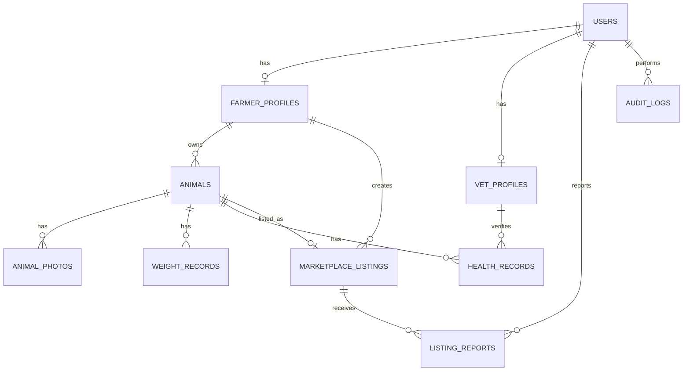

# Domain Model — V1

## Core entities

| Entity | Purpose |
|---|---|
| User | Account identity and role |
| FarmerProfile | Farm-specific profile and location |
| Animal | Main livestock record |
| AnimalPhoto | Animal media |
| WeightRecord | Growth tracking |
| HealthRecord | Vaccines, illness, treatment, checkups |
| MarketplaceListing | Public sale listing linked to an animal |
| VetProfile | Verified vet directory profile |
| ListingReport | Abuse/scam/sold/fake listing report |
| AuditLog | Sensitive admin/security action record |

## Role model

```text
UserRole = farmer | vet | admin
```

## Important business rules

- Buyers are public/guest users only in V1; there are no registered buyer accounts.
- Admin users are created only through `backend/app/scripts/create_admin.py`; public registration must reject `admin`.
- A farmer owns many animals.
- An animal belongs to exactly one farmer.
- A listing must be linked to one animal.
- One animal cannot have multiple active listings.
- A listing requires at least one animal photo.
- Dead or sold animals cannot be listed.
- A vet profile is public only after admin approval.
- Animal data is farmer-reported in V1 unless later verified.
- Exact farm location must not be public in V1.

## Entity relationships


